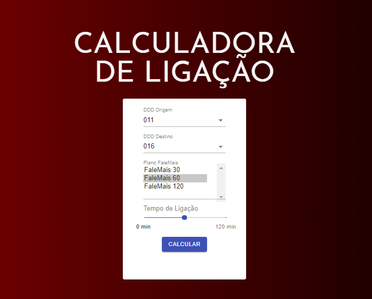

# Vortx Developer Challenge
The full exercicise can be found here: [https://www.vortx.com.br/uploads/ShowmethecodeBackend.pdf](https://www.vortx.com.br/uploads/ShowmethecodeBackend.pdf) <br>



1. Run the server-side Flask app in one terminal window:

    ```sh
    $ cd server
    $ python3.7 -m venv env
    $ source env/bin/activate
    (env)$ pip install -r requirements.txt
    (env)$ python3 run.py
    ```

    Navigate to [http://localhost:5000](http://localhost:5000)

2. Run the client-side React app in a different terminal window:

    ```sh
    $ cd client
    $ npm install
    $ npm start
    ```

    Navigate to [http://localhost:3000](http://localhost:3000)
    
3. To run the tests, go to **server folder** and open a terminal:

    ```sh
    $ pytest
    ```
